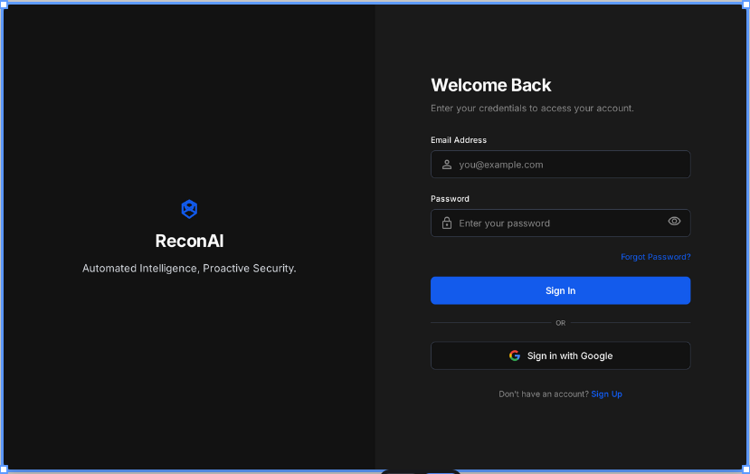
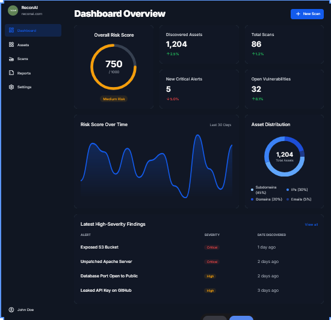
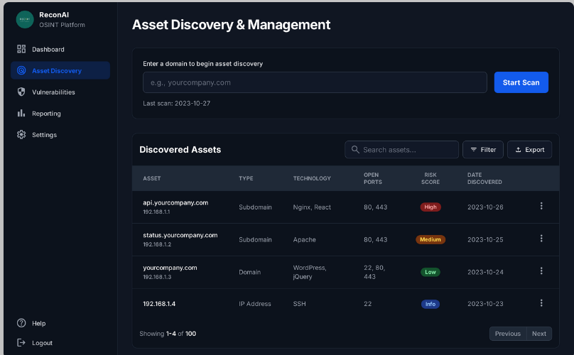
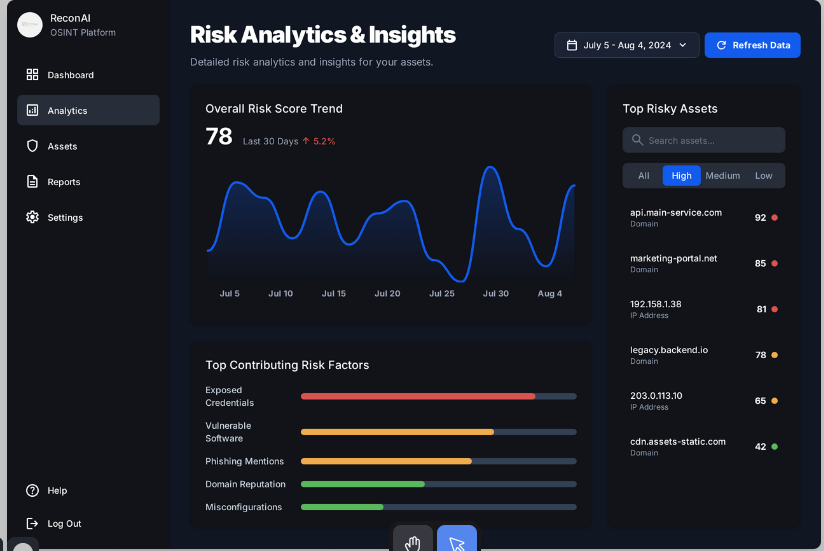
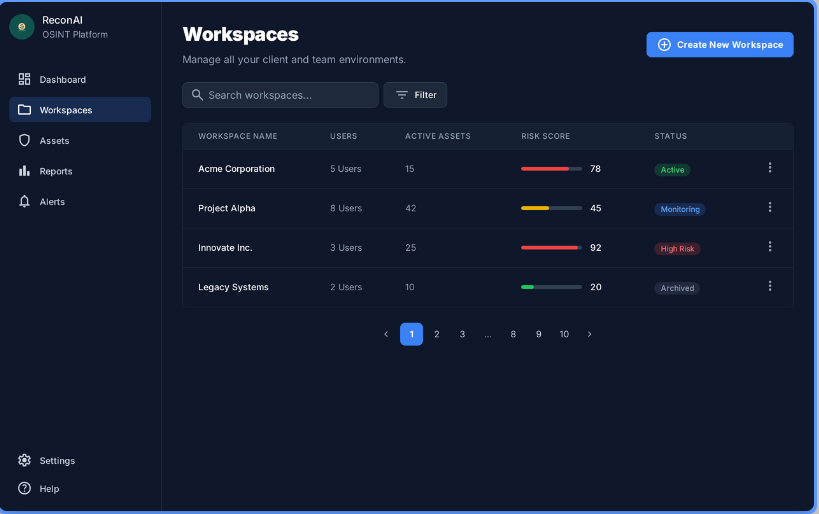
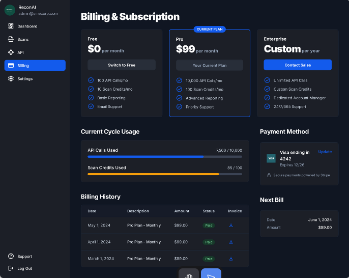

# DESIGN.md - ReconAI OSINT Platform

## Overview
**ReconAI** is an AI-driven OSINT (Open Source Intelligence) Attack Surface Scanner designed to help small and medium enterprises (SMEs) continuously monitor their digital exposure and cyber risks.

This document describes the **UI/UX design structure** of the ReconAI web application with screenshots for visual reference.

---

## 1. Login Page
**File:** recon-ai-login-page.png  
The login screen has a clean split layout:
- **Left side:** Branding section with logo and tagline “Automated Intelligence, Proactive Security.”  
- **Right side:** Login form with fields for email, password, and Google OAuth integration.  
- **Design:** Dark theme with minimalist blue accents and rounded form elements.

---

## 2. Dashboard Overview
**File:** recon-ai-dashboard-overview.png  
The dashboard presents a high-level overview of system security status:
- **Widgets:** Risk Score, Discovered Assets, Total Scans, New Alerts, and Open Vulnerabilities.
- **Visuals:** Line charts for trend visualization and pie chart for asset distribution.
- **Purpose:** Provide real-time situational awareness.

---

## 3. Asset Discovery & Management
**File:** recon-ai-asset-discovery.png  
This screen enables scanning and managing discovered assets:
- **Features:** Domain input field, scan initiation, filters, and export options.
- **Table View:** Lists assets, type, technology, open ports, risk score, and discovery date.
- **Purpose:** Core functionality for identifying organization’s digital footprint.

---

## 4. Risk Analytics & Insights
**File:** recon-ai-risk-analytics.png  
Analytical dashboard showing:
- **Graphs:** Risk Score trend over time.
- **Top Risk Factors:** Credentials, Vulnerable Software, Phishing Mentions, Misconfigurations.
- **Purpose:** Help security teams prioritize remediation based on risk impact.

---

## 5. Workspaces
**File:** recon-ai-workspaces.png  
A team-based management interface for handling multiple clients or environments:
- **Columns:** Workspace name, users, assets, risk score, and current status.
- **Purpose:** Supports multi-tenant architecture for organizations managing different entities.

---

## 6. Billing & Subscription
**File:** recon-ai-billing-subscription.png  
The billing screen allows plan management and payment tracking:
- **Plans:** Free, Pro, and Enterprise tiers.
- **Usage:** Shows API calls, scan credits, and next billing date.
- **Integration:** Stripe-based payment gateway.

---

## Design System Summary
- **Theme:** Dark Mode with Neon Blue Highlights  
- **Typography:** Sans-serif (Inter / Roboto style)  
- **UI Library:** Tailwind CSS + React Components  
- **Charting:** Recharts or Chart.js for graphs  
- **Icons:** Lucide / Heroicons for clarity  
- **Design Principles:**
  - Minimal clutter with focus on data visibility  
  - Smooth transitions and responsive layout  
  - Visual hierarchy to highlight critical alerts  

---

## Conclusion
The **ReconAI design** ensures a seamless user experience for cybersecurity professionals and SMEs by combining aesthetic dark-mode visuals with intuitive dashboards for continuous exposure monitoring.

---
